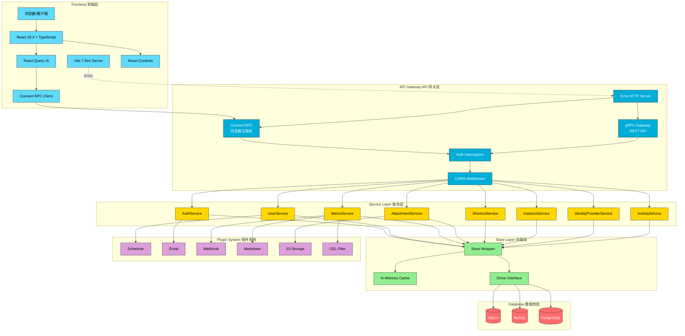
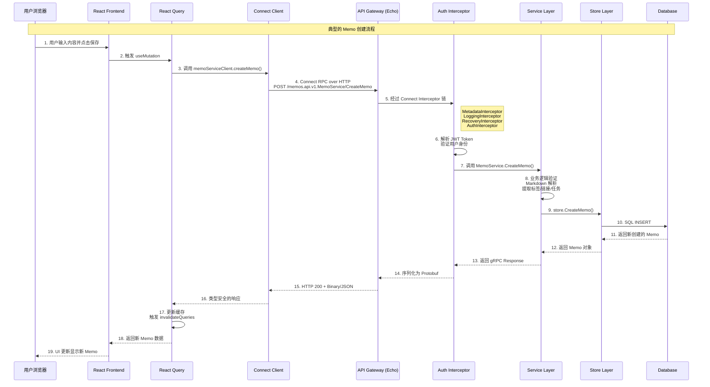
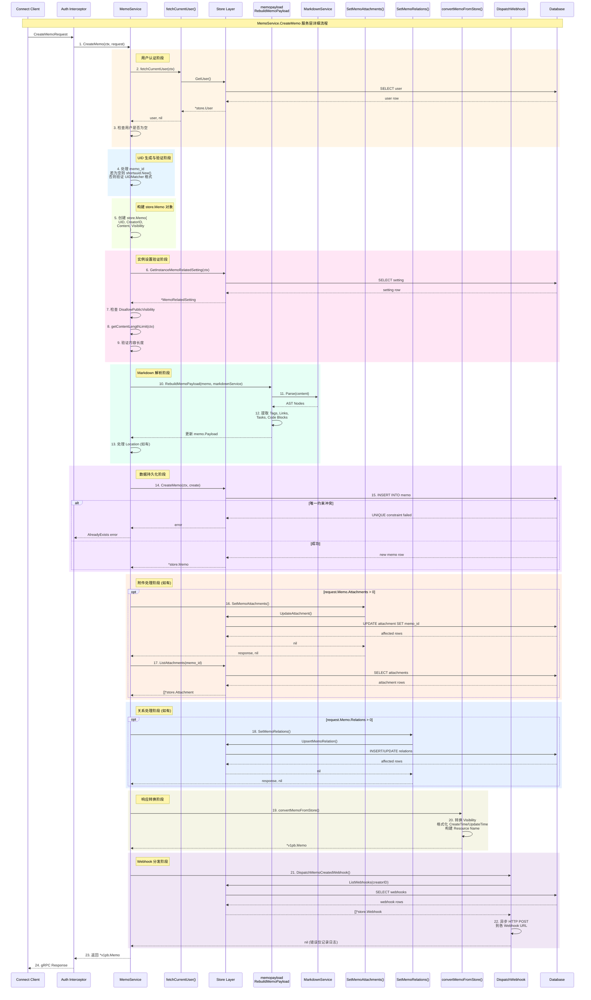
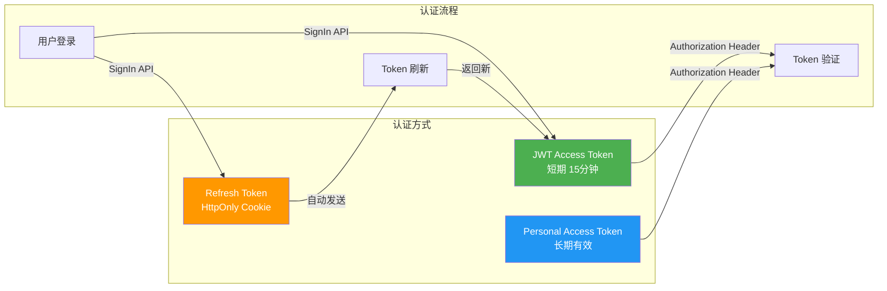
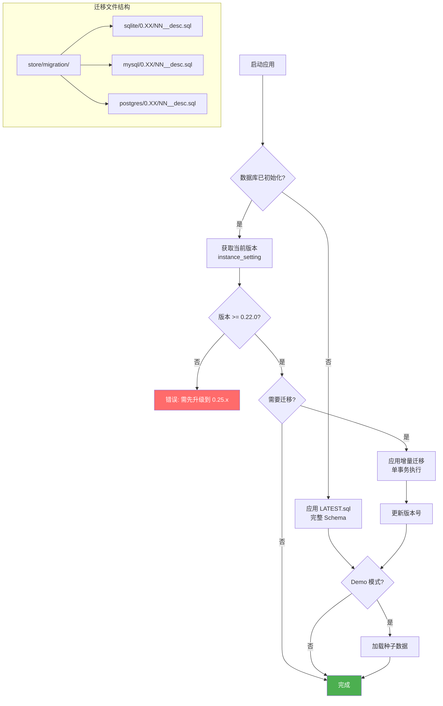
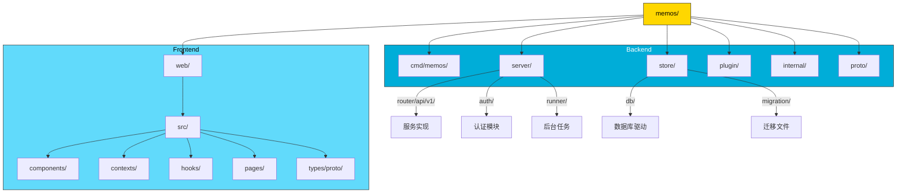

# Memos Architecture Overview

> 一页式架构图与数据流文档

## 🏗️ 整体架构图

---

## 🔄 数据流图

### MemoService.CreateMemo 详细时序图

---

## 🔐 认证流程

---

## 📊 数据库迁移流程

---

## 📁 项目目录结构

---

## 🗂️ 关键文件摘录

### 后端关键文件

| 分类 | 文件路径 | 职责描述 |
|------|---------|---------|
| **入口点** | `cmd/memos/main.go` | Cobra CLI 入口，Profile 配置，服务器初始化 |
| **服务器** | `server/server.go` | Echo HTTP 服务器，健康检查，后台任务启动 |
| **API 注册** | `server/router/api/v1/v1.go` | gRPC-Gateway + Connect RPC 注册，服务绑定 |
| **公开端点** | `server/router/api/v1/acl_config.go` | 无需认证的公开 API 白名单配置 |
| **认证拦截器** | `server/router/api/v1/connect_interceptors.go` | Metadata/Logging/Recovery/Auth 拦截器链 |
| **认证逻辑** | `server/auth/authenticator.go` | JWT V2 + PAT 验证逻辑 |
| **Connect 服务** | `server/router/api/v1/connect_services.go` | Connect RPC Handler 注册 |
| **Memo 服务** | `server/router/api/v1/memo_service.go` | Memo CRUD 业务逻辑 |
| **User 服务** | `server/router/api/v1/user_service.go` | 用户管理业务逻辑 |
| **存储包装器** | `store/store.go` | Store 封装，缓存管理 |
| **驱动接口** | `store/driver.go` | 数据库驱动统一接口定义 |
| **迁移器** | `store/migrator.go` | Schema 版本管理，迁移执行 |
| **SQLite 驱动** | `store/db/sqlite/sqlite.go` | SQLite 具体实现 |

### 前端关键文件

| 分类 | 文件路径 | 职责描述 |
|------|---------|---------|
| **入口** | `web/src/main.tsx` | React 应用入口，Provider 配置 |
| **根组件** | `web/src/App.tsx` | 应用根组件，全局 Effect |
| **Connect 客户端** | `web/src/connect.ts` | RPC 客户端创建，Token 刷新拦截器 |
| **Query Client** | `web/src/lib/query-client.ts` | React Query 配置 |
| **Auth Context** | `web/src/contexts/AuthContext.tsx` | 用户认证状态管理 |
| **Instance Context** | `web/src/contexts/InstanceContext.tsx` | 实例配置状态管理 |
| **View Context** | `web/src/contexts/ViewContext.tsx` | UI 偏好设置（布局/排序）|
| **Memo Filter Context** | `web/src/contexts/MemoFilterContext.tsx` | 过滤器状态，URL 同步 |
| **Memo Queries** | `web/src/hooks/useMemoQueries.ts` | Memo CRUD Hooks |
| **User Queries** | `web/src/hooks/useUserQueries.ts` | 用户操作 Hooks |
| **Vite 配置** | `web/vite.config.mts` | 开发代理，构建配置 |
| **Biome 配置** | `web/biome.json` | 代码格式化/Lint 配置 |

### Proto 关键文件

| 文件路径 | 职责描述 |
|---------|---------|
| `proto/api/v1/memo_service.proto` | Memo 服务 RPC 定义 |
| `proto/api/v1/user_service.proto` | 用户服务 RPC 定义 |
| `proto/api/v1/auth_service.proto` | 认证服务 RPC 定义 |
| `proto/api/v1/instance_service.proto` | 实例服务 RPC 定义 |
| `proto/api/v1/attachment_service.proto` | 附件服务 RPC 定义 |
| `proto/buf.gen.yaml` | Buf 代码生成配置 |
| `proto/buf.yaml` | Buf lint/breaking 规则 |
| `proto/gen/api/v1/` | 生成的 Go 代码 |
| `web/src/types/proto/api/v1/` | 生成的 TypeScript 代码 |

### 迁移关键文件

| 文件路径 | 职责描述 |
|---------|---------|
| `store/migration/sqlite/LATEST.sql` | SQLite 完整 Schema（新安装用）|
| `store/migration/mysql/LATEST.sql` | MySQL 完整 Schema |
| `store/migration/postgres/LATEST.sql` | PostgreSQL 完整 Schema |
| `store/migration/{driver}/0.XX/*.sql` | 增量迁移脚本 |
| `store/seed/` | Demo 模式种子数据 |

---

## ⚡ 技术栈速览

| 层级 | 技术选型 | 版本 |
|-----|---------|-----|
| **后端语言** | Go | 1.25 |
| **HTTP 框架** | Echo | v4 |
| **API 协议** | gRPC + Connect RPC | - |
| **Protobuf** | Protocol Buffers v2 + buf | 2.x |
| **前端框架** | React | 18.3 |
| **前端语言** | TypeScript | 5.x |
| **构建工具** | Vite | 7.x |
| **状态管理** | React Query + Context | v5 |
| **CSS 框架** | Tailwind CSS | v4 |
| **UI 组件** | Radix UI | - |
| **Linting** | Biome (前端) / golangci-lint (后端) | - |
| **数据库** | SQLite / MySQL / PostgreSQL | - |

---

## 🔗 快速导航

- **后端开发**: 参见 [`server/AGENTS.md`](./server/AGENTS.md)
- **前端开发**: 参见 [`web/AGENTS.md`](./web/AGENTS.md)
- **完整指南**: 参见 [`AGENTS.md`](./AGENTS.md)
